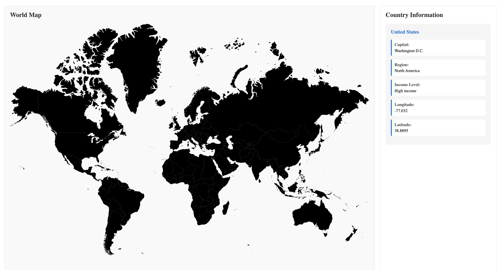

# Interactive World Map Application

An interactive world map built with Angular that displays real-time country information from the World Bank API. Click any country to view detailed data including capital, region, income level, and geographic coordinates.



## 🌟 Features

- 🗺️ **Interactive SVG World Map** - Click any country for instant information
- 🌍 **Real-Time Data** - Fetches live country data from World Bank API
- 📊 **Comprehensive Info** - Displays 6 key country properties
- 📱 **Responsive Layout** - Clean two-column design with map and info panel
- ⚡ **Fast & Efficient** - Built with Angular for optimal performance

## 🛠️ Technologies Used

- **Angular 14** - Component-based framework
- **TypeScript** - Type-safe development
- **RxJS** - Reactive programming for HTTP requests
- **World Bank API** - Real-time country data
- **HttpClient** - RESTful API integration
- **Angular Router** - Single-page application navigation

## 📋 Country Data Displayed

- Country Name
- Capital City
- Geographic Region
- Income Level Classification
- Longitude Coordinates
- Latitude Coordinates

## 🚀 Getting Started

### Prerequisites

- Node.js (v16 or higher)
- npm or yarn
- Angular CLI

### Installation

1. Clone the repository
```bash
git clone https://github.com/magelvl12/world-map-angular.git
cd world-map-angular
```

2. Install dependencies
```bash
npm install
```

3. Start the development server
```bash
ng serve
```

4. Open your browser and navigate to `http://localhost:4200/`

## 💻 Usage

1. The application loads with an interactive world map
2. Click on any country to view its information
3. Country details appear in the right panel
4. Data is fetched in real-time from the World Bank API

## 🏗️ Project Structure
```
src/
├── app/
│   ├── map/                    # Map component
│   │   ├── map.component.ts    # Component logic
│   │   ├── map.component.html  # Template
│   │   └── map.component.css   # Styles
│   ├── services/               # API services
│   │   └── country.service.ts  # World Bank API integration
│   ├── app-routing.module.ts   # Route configuration
│   └── app.module.ts           # App configuration
└── assets/
    └── map-image.svg           # World map SVG file
```

## 🔧 Technical Implementation

### Component Architecture
- **MapComponent**: Handles SVG rendering and user interactions
- **CountryService**: Manages API calls using Angular's HttpClient

### Event Binding
- Click events on SVG paths trigger country selection
- Dynamic data binding updates UI in real-time

### API Integration
- RESTful calls to `https://api.worldbank.org/v2/country/{code}`
- Observable-based data flow with RxJS

## 📦 Build

To build the project for production:
```bash
ng build --configuration production
```

The build artifacts will be stored in the `dist/` directory.

## 🤝 Contributing

This is a portfolio project, but suggestions and feedback are welcome!

## 📝 License

This project is open source and available under the MIT License.

## 👤 Author

Joshua Logan
- GitHub: [@magelvl12](https://github.com/magelvl12)

## 🙏 Acknowledgments

- World Bank API for providing country data
- SVG world map from [innovsandbox.space](https://innovsandbox.space/)
- Angular team for the excellent framework

